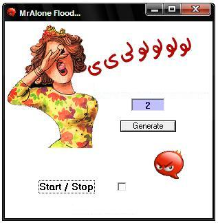



## Skype Flooder

### Description

With this little code you can send multitudes of smiley in chat window of Skype,

to change and adapt with your favorite chat, you just change the file AloneSmiley.mp3 by shortening of the smiley of your favorite chat.

You can use it for Yahoo, Windows Live, Paltalk, Camfrog, Beylux ...
 
### More Info
 

             |
---                |---
**Submitted On**   |2010-12-06 13:09:04
**By**             |[MrAlone \- Tunisia](https://github.com/Planet-Source-Code/PSCIndex/blob/master/ByAuthor/mralone-tunisia.md)
**Level**          |Intermediate
**User Rating**    |5.0 (15 globes from 3 users)
**Compatibility**  |VB 3\.0, VB 4\.0 \(16\-bit\), VB 4\.0 \(32\-bit\), VB 5\.0, VB 6\.0
**Category**       |[Complete Applications](https://github.com/Planet-Source-Code/PSCIndex/blob/master/ByCategory/complete-applications__1-27.md)
**World**          |[Visual Basic](https://github.com/Planet-Source-Code/PSCIndex/blob/master/ByWorld/visual-basic.md)
**Archive File**   |[Skype\_Floo21944612122010\.zip](https://github.com/Planet-Source-Code/mralone-tunisia-skype-flooder__1-73633/archive/master.zip)

